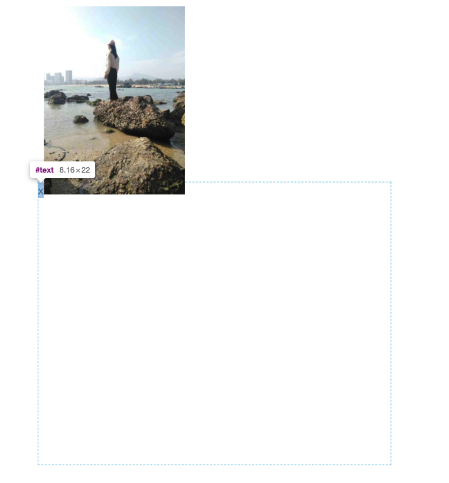

# margin-collapsing

> margin-collapsing 我们中文一般称为 「margin 塌陷」或叫 「margin 重叠」。

### 可视尺寸 与 占据尺寸

- 可视尺寸即肉眼能看到的尺寸等于 padding + border + width
- 占据尺寸即能占据空间的尺寸等于 margin + padding + border + width

观察上面可知：占据尺寸 = 可视尺寸 + margin。

### margin 如何影响可视尺寸与占据尺寸

1. 对可视尺寸来讲（只影响可视尺寸的width，可用于「一侧定宽的两栏的布局」）
    - 垂直方向上永远影响不了
    - 块级元素水平方向未设置宽度时，margin 为正，可视尺寸缩小，margin 为负，可视尺寸扩大。

我曾经遇到有的人做**两端对齐 **给盒子扩展 1px 这么写过：`width： calc(100% + 1px)`，完全没必要直接 `margin-right/margin-left: -1px;` 即可解决。

2. 对占据尺寸来讲（只影响占据尺寸的margin，可用于「等高布局 margin-bottom: -100%;padding-bottom: 100%;」）
    - 对 block 元素来讲影响任何方向
    - 对 inline 元素只影响水平方向


### margin 百分比单位参考谁

margin 垂直方向的百分比和水平方向的百分比都是参考容器的宽计算的，这是因为高度默认是零，margin-top/margin-bottom 参考height 没有意义。

- 一般情况下参考父级元素的宽度
- 绝对定位的元素参考第一个定位（fixed、relative、absolute）的祖先级元素的宽度

利用 margin 百分比和 margin collapseing 这些特性可以做一些布局的效果，例如：
宽高 2:1 自适应的矩形：

```html
<!DOCTYPE html>
<html lang="en">
<head>
    <meta charset="UTF-8">
    <meta name="viewport" content="width=device-width, initial-scale=1.0">
    <title>矩形</title>
    <style>
        .box {
            width: 40vw;
            overflow: hidden;
            background-color: skyblue;
        }
        .box div {
            margin: 50%;
        }
    </style>
</head>
<body>
    <div class="box">
        <div></div>
    </div>
</body>
</html>
```

宽高 1:1 自适应的矩形：

```html
<!DOCTYPE html>
<html lang="en">
<head>
    <meta charset="UTF-8">
    <meta name="viewport" content="width=device-width, initial-scale=1.0">
    <title>矩形</title>
    <style>
        .box {
            width: 40vw;
            overflow: hidden;
            background-color: skyblue;
        }
        .box div {
            margin: 100%;
        }
    </style>
</head>
<body>
    <div class="box">
        <div></div>
    </div>
</body>
</html>
```

上面两个案例使用 padding 实现也行。

### margin 重叠发生的条件

1. block element（块级元素）
2. 只会发现在垂直方向上，也就是只有 margin-top margin-bottom 两个属性会出现， margin-right margin-left 则不会出现。

### margin 重叠常见场景

#### 1. 相邻的兄弟元素

```html
div {
    width: 200px;
    height: 200px;
}
.brother-1 {
    background-color: #0099cc;
    margin-bottom: 50px;
}
.brother-2 {
    background-color: #cc33cc;
    margin-top: 150px;
}
<div class="brother-1"></div>
<div class="brother-2"></div>
```

#### 2. 父级和第一个/最后一个子元素（父级只有一个元素）

以下三种情况等价：
```html
// 第一种
.father {
    width: 200px;
    height: 200px;
    background-color: #0099cc;
}
.son {
     width: 100px;
    height: 100px;
    background-color: #cc33cc;
    margin-top: 150px;
}
// 第二种
.father {
    width: 200px;
    height: 200px;
    background-color: #0099cc;
    margin-top: 150px;
}
.son {
     width: 100px;
    height: 100px;
    background-color: #cc33cc;
}
// 第三种
.father {
    width: 200px;
    height: 200px;
    background-color: #0099cc;
    margin-top: 150px;
}
.son {
    width: 100px;
    height: 100px;
    background-color: #cc33cc;
    margin-top: 150px;
}
<div class="father">
    <div class="son"></div>
</div>
```
#### 3. 空的块级元素，自我重叠

```html
*{ margin: 0; }
div {
    width: 200px;
    height: 200px;
}
.A {
    background-color: #0099cc;
}
.B {
    background-color: #cc33cc;
}
.empty {
    margin-top: 10px;
    margin-bottom: 10px;
}
<div class="A"></div>
<p class="empty"></p>
<div class="B"></div>
```

### margin 合并取值方法

1. 正正取大
2. 负负取小
3. 正负取和

### 解决 margin 重叠的方法

#### 解决父子 margin 重叠的方法

1. 采用 `-webkit-margin-collapse: separate;` 属性去除
2. 设置块级格式化上下文
3. 对 margin-top 设置 border-top，对 margin-bottom 设置 border-bottom
4. 对 margin-top 设置 padding-top，对 margin-bottom 设置 padding-bottom
5. 父子之前没有行内元素，例如加个 `&nbsp;` 空格利用伪元素给子元素的前面添加一个空元素
6. 此条只针对 margin-bottom，父元素可以设置 height/min-height/max-height 来去除 margin 重叠

#### 解决空块级元素 margin 重叠的方法

1. 空元素没有设置 border
2. 空元素没有设置 padding
3. 空元素里面没有 inline 元素
4. 空元素不能设置 height/min-height，不过可以设置 max-height

#### 解决相邻元素 margin 重叠的方法

1. 包裹一层父元素，创建 BFC
2. 我们可以使用 -webkit-margin-collapse 及其分拆后的 -webkit-margin-top-collapse、-webkit-margin-bottom-collapse 等属性来控制 margin 塌陷的现象。

    - collapse 默认值发生重叠；
    - discard 取消重叠，margin 重叠部分为 0 即无 margin；
    - separate 不发生重叠，margin 重叠部分为 margin-top + margin-bottom；


### margin 重叠的意义

1. 空元素 margin 重叠的意义

HTML 中有个空白折叠现象，你在 HTML 中无论连续打多少 「空格、tab、会车」 浏览器在渲染的时候就只有一个空格，这是防止编程不规范，当出现连续的 「空格、tab、会车」 不会导致页面风格大变。空元素的 margin 重叠意义也和空白折叠现象异曲同工。比如一篇文章好多好多段落，我们使用 `<p></p>` 标签来布局的时候，为了美观一般 p 标签上下都有 margin 来分割段落，万一我们不小心打了好多空的  p 标签，没有 margin 合并会造成大量的空白。而有了 margin 合并，这时候先发生 **空元素的 margin 重叠**，在发生**相邻兄弟的 margin 重叠**，然后就发生大量空的 p 标签无效，没有影响页面布局。

1. 父子 margin 重叠的意义

这个很好理解，如果父子不发生 margin 重叠，我给子元素设置上下 margin 会影响父子两个元素，如果又父子 margin 重叠的话，只会影响一个父元素。这就是 **父子 margin 重叠的意义**，最小程度的影响布局元素。

就有个张鑫旭总结的一句话：**页面任何地方直接放入或嵌套任何裸 div，都不会影响原来的布局。**

2. 相邻兄弟 margin 重叠的意义

同样举**一篇文章好多好多段落**这个例子，先假设没有相邻兄弟 margin 重叠，为了布局好看此时添加 margin。
    - 只给 p 标签设置，margin-top 会发现最后一个元素的底部没有 margin ，需要单独设置 margin-bottom，如果移除最后一个元素，还的手动再次设置 margin-bottom
    - 只给 p 标签设置，margin-bottom 会发现第一个元素的顶部没有 margin ，需要单独设置 margin-top，如果移除第一个元素，还的手动再次设置 margin-top
    - 同时给 p 标签设置，margin-bottom 和 margin-top ，会发现第一个元素顶部少一个 margin-bottom ，最后一个元素少一个 margin-top 一个

由此我们发现在进行段落布局的时候，只设置一个方向的 margin，不能随意移除顶部或底部的元素，如果设置两个方向的 margin ，同时不能随意移除顶部和底部的元素。无论选择哪一种都有一个核心的问题：**不能随意移除布局元素**。

这时候如果有**相邻兄弟 margin 重叠**，我们同时设置上下 margin，p 与 p 标签之间的 margin 会合并成一个，第一个 p 标签的顶部和最后一个 p 标签的底部本来就只有一个方向上的重叠，此时可以随意更改 p 标签的顺序。

看完，你会发现三种 margin 重叠，只是为了解决不同的应用场景，**本质都是为了页面布局更加合理。**，所以那些面试官问如何去除 margin 重叠，你在讲完上面的内容，最后别忘了怼他以下，「margin 重叠本来就是为了让页面布局更加合理」只有小白才会傻傻的要去除所谓的 margin 重叠。


### `margin: auto;`

`margin: auto;` 默认情况下只对块级元素水平方向有效。这是因为块级元素定完宽和高之后，水平方向上会被 margin 铺满，auto 可以自动计算这些被 margin 铺满的剩余空间如何被分配。

所以，虽然内联元素水平方向可以设置 margin，但是内联元素不会占一整行，即剩余空间不会被 margin 填充，那么 auto 就会因为无值计算不生效。

如何使用 `margin: auto;` 做垂直居中：

1. 父元素设置 `writing-mode: vertical-lr;`，改水平流为垂直流
2. 定位 `position: absolute;`

```html
<!DOCTYPE html>
<html lang="en">
<head>
    <meta charset="UTF-8">
    <meta name="viewport" content="width=device-width, initial-scale=1.0">
    <title>垂直居中</title>
    <style>
        div {
            width: 200px;
            height: 200px;
            border: 1px dashed khaki;
            position: absolute; /* fixed */
            left: 0;
            right: 0;
            top: 0;
            bottom: 0;
            margin: auto;
        }
    </style>
</head>
<body>
    <div>

    </div>
</body>
</html>
```

### 内联元素导致的 margin 无效

这是因为替换元素前面有个幽灵空白节点，我们 x 来替代，文字 x 属于内联元素，无法突破盒子，而图片和文字又是 vertical-align: baseline; 的对齐方式，导致 margin 无效。
```html
<!DOCTYPE html>
<html lang="en">
<head>
    <meta charset="UTF-8">
    <meta name="viewport" content="width=device-width, initial-scale=1.0">
    <title>margin</title>
    <style>
        div {
            width: 500px;
            height: 400px;
            border: 1px dashed skyblue;
            position: absolute;
            left: 0;
            right: 0;
            top: 0;
            bottom: 0;
            margin: auto;
        }
        img {
            margin-top: -9999px;
        }
    </style>
</head>
<body>
    <div>
        x
    </div>
</body>
</html>
```



### margin-start/margin-end

margin 的 top/bottom/left/right 无论流的方向如何永远是固定的，所以出现了 margin-start/margin-end ，它两个属于 CSS3 范畴，是伴随着 CSS 的流(writing-mode/direction: rtl;)特性诞生的。