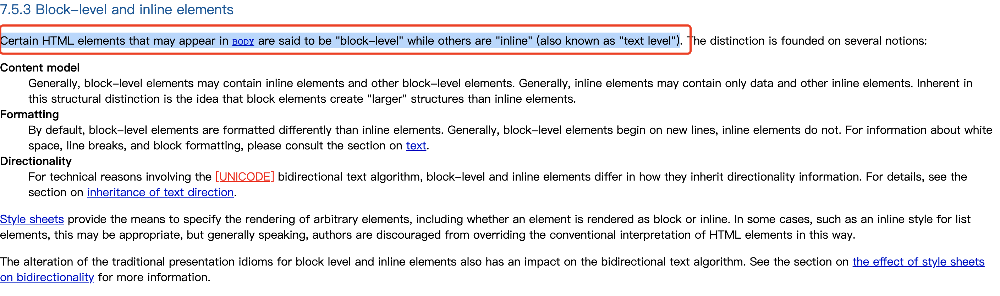
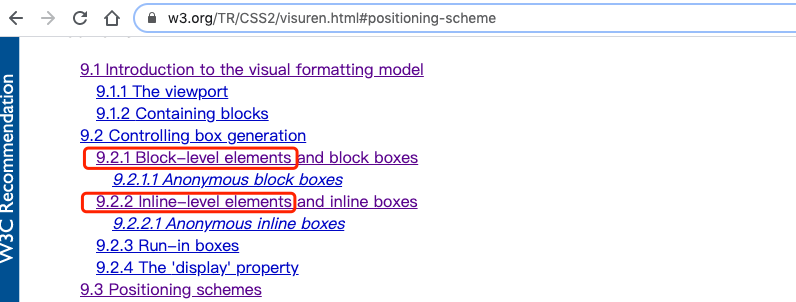
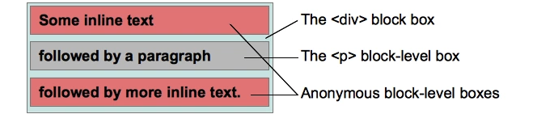

# 一些搞不清楚的 CSS 术语

> 正在写 CSS 里面关于 IFC 的笔记📒 ，写着写着发现好多概念比较模糊，不是很清楚，必须整理下，在查阅 MDN 文档的时候你会发现一些进阶的内容，MDN 中文版给翻译的那是缺斤少两，还是的看英文文档 🤨。


概念表：

- 盒子：box
- 块：block
- 包含块：containing block
- 块级元素：block-level element
- 块级盒子：block-level box
- 块盒子：block box
- 具名块盒
- 匿名块盒子（Anonymous block box）
- 块容器盒子：block container box 或 block containing box
- 行内级元素：inline-level element
- 行内级盒子：inline-level box
- 行内盒子：inline box，参与行内格式化上下文创建的行内级盒子称为行内盒子。与块盒子类似，行内盒子也分为具名行内盒子和匿名行内盒子（anonymous inline box）两种。
- 原子行内级盒子：atomic inline-level box
- 包含区域（content area）
- 附加盒子
- 标记盒子
- 主块级盒子


### 标签(tag)和元素(element)

结论：元素是包含标签的。

无耻的去拿 MDN 图片：


[图片来自 MDN 开始学习 HTML](https://developer.mozilla.org/zh-CN/docs/Learn/HTML/Introduction_to_HTML/Getting_started)

看没看到**元素（Element）是开始标签（Opening tag）、结束标签（Closing tag）与内容（Content）相结合的产物。**

#### 空元素

**可以认为空元素就是单标签**。

MDN 概念：不是所有元素都拥有开始标签、内容、结束标签。一些元素只有一个标签，通常用来在此元素所在位置插入/嵌入一些东西。例如：元素 `` 插入一张指定的图片。

#### 替换元素和非替换元素（ replaced versus non-replaced elements）

修改某个属性值元素呈现的内容可以改变的元素就是**替换元素（replaced elements）**，例如 `、<object>、<video>、<audio>、<textarea>、<iframe>` 等。否则就是非替换元素。

#### 块级元素和内联元素（Block versus inline elements）

元素按是否独占一行，可分为：**块级元素（block-level elements）和内联元素（inline elements）。**

1. **块级元素在页面中以块的形式展现** —— 相对于其前面的内容它会出现在新的一行，其后的内容也会被挤到下一行展现（独占一行）。**块级元素通常用于展示页面上结构化的内容**，例如段落、列表、导航菜单、页脚等等。一个以 block 形式展现的块级元素不会被嵌套进内联元素中，但可以嵌套在其它块级元素中。

2. **内联元素通常出现在块级元素中并环绕文档内容的一小部分**，而不是一整个段落或者一组内容。**内联元素不会导致文本换行**：它通常出现在一堆文字之间例如超链接元素 `<a>` 或者强调元素 `<em>` 和 `<strong>`。


> 有个问题就是，到底是内联元素（inline elements）还是内联级元素（inline-level elements）？
> 到底有没有这个级字，朕是纠结了好几天。

从 HTML 的角度看：

1. 早期分为：`block-level elements or inline-level elements`

参考：[MDN](https://developer.mozilla.org/en-US/docs/Web/HTML/Inline_elements)，其中有句话如下，很简单不用翻译：

> HTML (Hypertext Markup Language) elements historically were categorized as either "block-level" elements or "inline-level" elements.

2. HTML4. ：`block-level elements or inline elements` 

点击查看 [W3C HTML4. Block-level and inline elements](https://www.w3.org/TR/html4/struct/global.html#h-7.5.3) 定义如下，也不用翻译了：


HTML5: 不再定义块和内联元素，而是对元素进行了详细的分类，**使得元素分类定义更加精确，但是 TMD 也更加难懂了**

中英文的详细分类如下，看英文的就行，一看就懂没必要看中文：

> 注意⚠️ This section is non-normative. 还没有成为规范。

- [content-categories](https://html.spec.whatwg.org/multipage/indices.html#element-content-categories)
- [内容分类](https://developer.mozilla.org/zh-CN/docs/Web/Guide/HTML/Content_categories)


从 [CSS2.](https://www.w3.org/TR/CSS2/visuren.html) 的角度看：


> elements: block-level elements or inline-level elements

脉络清晰了，注意这不代表我们平时必须严格按规范说，实际上，口语交流中：**块、块级元素、块元素三个概念基本可以等价，主要突出的是 block，内联元素同样如此。**

### W3C CSS2. 模块中的 Visual formatting model 篇里面的核心概念

可视化格式模型/视觉格式化模型（Visual formatting model）：https://developer.mozilla.org/zh-CN/docs/Web/Guide/CSS/Visual_formatting_model

需要精读一遍，我捡些重要的翻译下：

9.1 Introduction to the visual formatting model（可视化格式模型/视觉格式化模型）


how user agents process the document tree for visual media.
VFM (visual formatting model)就是用来决定电脑上（visual media 最常见的就是电脑了）的浏览器（user agents 最常见的就是浏览器）是如何展现 HTML 元素（document tree 就是元素，也是标签）的。比如 div 和 span 标签在浏览器有着不同的规则，再简单点讲就是一个平常的 div 标签在浏览器如何渲染。。

In the visual formatting model, each element in the document tree generates zero or more boxes according to the box model. The layout of these boxes is governed by:

**在 VFM（visual formatting model） 中，每一个 html 元素在浏览器中渲染的时候，都会根据盒模型生成零个（display: none;）或多个盒子（display: inline-block;），这些生成的盒子受下面规则的影响：**

- box dimensions and type.  盒模型和盒子的类型。
- positioning scheme (normal flow, float, and absolute positioning). 盒子的定位方案，（正常流（我一般喜欢叫标准文档流）、浮动流、定位流）
- relationships between elements in the document tree. 周围元素的影响
- external information (e.g., viewport size, intrinsic dimensions of images, etc.). 设备不同导致

The properties defined in this chapter and the next apply to both continuous media and paged media. However, the meanings of the margin properties vary when applied to paged media (see the page model for details).

这章和下章讲解的 CSS 属性，在浏览器上都能完美运行，~~但是 margin 这个属性在不同的设备表现有所不同，例如浏览器设备和打印机设备就表现的不一致~~。

> 前端代码可以运行在不同的可视化媒体上，例如浏览器设备、打印机设备等等。设备太多了，需要分下组，常见的浏览器、盲文阅读器、电子设备都属于 continuous media 组，而打印机等属于 paged media 组，look this ：[paged-media-group](https://www.w3.org/TR/CSS2/media.html#paged-media-group)

The visual formatting model does not specify all aspects of formatting (e.g., it does not specify a letter-spacing algorithm). Conforming user agents may behave differently for those formatting issues not covered by this specification.

VFM 并没有对盒子各个方面的属性作出规定，（例如：letter-spacing 这个 CSS 属性）这些属性属于用户审美，本规范不做规定，由浏览器厂商自己酌情处理实现。

9.1.1 The viewport 视口

User agents for continuous media generally offer users a viewport (a window or other viewing area on the screen) through which users consult a document. User agents may change the document’s layout when the viewport is resized (see the initial containing block).
电脑上打开的浏览器会提供一个**视口（The viewport就是浏览器窗口）**来供用户浏览文档，使用鼠标拖动浏览器改变窗口大小，视口（浏览器窗口）会重新调整。

When the viewport is smaller than the area of the canvas on which the document is rendered, the user agent should offer a scrolling mechanism.
当视口（浏览器窗口）小于文档的画布区域时，**浏览器应该提供滚动条**。

There is at most one viewport per canvas, but user agents may render to more than one canvas (i.e., provide different views of the same document).
每个画布区域最多只有一个视口（浏览器窗口），但是浏览器可以渲染出不止一个画布，可不是吗，一个浏览只能有一个窗口，却可以有多个 Tab（多个画布）

9.1.2. Containing blocks 包含块

In CSS 2, many box positions and sizes are calculated with respect to the edges of a rectangular box called a containing block. In general, generated boxes act as containing blocks for descendant boxes; we say that a box "establishes" the containing block for its descendants. The phrase "a box’s containing block" means "the containing block in which the box lives," not the one it generates.

在 CSS2 中，盒子的位置和大小是根据一个叫包含块的矩形盒子计算出来的。一般情况下，生成盒子会作为它生成的子盒子的包含块；我们会说一个盒子为它生成的子盒子建立了包含块。所以讲包含块是一个**相对**的概念。

Each box is given a position with respect to its containing block, but it is not confined by this containing block; it may overflow.

**每个盒子都会根据包含块来计算自己的位置，当子盒子比包含块大时，就会溢出（overflow）。**

9.2. Controlling box generation 浏览器如何控制盒子的生成

The following sections describe the types of boxes that may be generated in CSS 2. A box’s type affects, in part, its behavior in the visual formatting model. The display property, described below, specifies a box’s type.

接下来聊聊在 CSS2 中不同盒子的类型，在浏览器会生成哪些盒子。display 的值决定了盒子的类型，不同盒子的类型会影响元素最终在浏览器上的呈现。

9.2.1. Block-level elements and block boxes 块级元素 和 块盒子

Block-level elements are those elements of the source document that are formatted visually as blocks (e.g., paragraphs). The following values of the display property make an element block-level: block, list-item, and table.

**块级元素是那些能独占一行的元素，例如`<p></p> 和 <div></div>` 等元素。如果给元素的 display 设置值为 block、list-item 或 table。此元素就会变成块级元素。**

Block-level boxes are boxes that participate in a block formatting context. Each block-level element generates a principal block-level box that contains descendant boxes and generated content and is also the box involved in any positioning scheme.

块级盒子参与 BFC 的生成，内联级盒子参与 IFC 的生成。**块级元素会生成一个主块级盒子（principal block-level box），这个主块级盒子包括后代盒子和生成的内容，而且主块级盒子也受定位方案的影响。**

Some block-level elements may generate additional boxes in addition to the principal box: list-item elements. These additional boxes are placed with respect to the principal box.

[list-Item 的附加盒子称为标记盒子](https://www.w3.org/TR/CSS2/visuren.html#display-prop)
This value causes an element (e.g., LI in HTML) to generate a principal block box and a marker box. 

**一些块级元素，例如 `display: list-item;` 会生成一个主块级盒子（principal block-level box）和 附加盒子（additional boxes），这些附加盒子是相对于主盒子放置的。list-item 的附加盒子是有名字的叫标记盒子（mark box）**。

Except for table boxes, which are described in a later chapter, and replaced elements, a block-level box is also a block container box. A block container box either contains only block-level boxes or establishes an inline formatting context and thus contains only inline-level boxes. Not all block container boxes are block-level boxes: non-replaced inline blocks and non-replaced table cells are block containers but not block-level boxes. Block-level boxes that are also block containers are called block boxes.

除了在后面章节中讲到 table box 和替换元素（replaced elements）之外，**块级盒子同时也是块包含盒子**，块包含盒子要么只包含块级盒子，要么建立一个 IFC（内联格式上下文），然后在只包含内联级盒子。并非所有的块容器框都是块级别的框：未替换的内联块和未替换的表单元是块容器，但不是块级框。一个盒子同时是块级盒子和块包含盒子叫做块盒子（block boxes）。

The three terms "block-level box," "block container box," and "block box" are sometimes abbreviated as "block" where unambiguous.

**平时这三个概念，块级盒子、块包含盒子、块盒子不需要特意区分，大部分缩称为块就行了。**

9.2.1.1. Anonymous block boxes 匿名块级盒子

这块 W3C 讲的太糟糕，我尝试理解着写下。

有以下 HTML 代码：

```html
<div>
    some inline text
    <p>followed by a paragraph</p>
    followed by more inline text
</div>
```

浏览器运行，HTML 最终效果呈现是三个段落。

上例：一个块包含盒子 div，里面有一些内联内容和块内容，为了便于我们和浏览器理解，需要添加一个写补充性的盒子，这些盒子就是匿名块级盒子（Anonymous block boxes），它们只能被感知不能被 CSS 选择器选中，这就意味着，它们的某些样式属性值能继承父亲就继承，继承不了的有自己的默认值。

创建的两个匿名盒子，一个包含 `<p>` 前面的文本(Some inline text),一个包含 `<p>` 后面的文本(followed by more inline text)，图示如下：


When an inline box contains an in-flow block-level box, the inline box (and its inline ancestors within the same line box) is broken around the block-level box (and any block-level siblings that are consecutive or separated only by collapsible whitespace and/or out-of-flow elements), splitting the inline box into two boxes (even if either side is empty), one on each side of the block-level box(es). The line boxes before the break and after the break are enclosed in anonymous block boxes, and the block-level box becomes a sibling of those anonymous boxes. When such an inline box is affected by relative positioning, any resulting translation also affects the block-level box contained in the inline box.

一个内联盒子包含一个未脱标的块级盒子，这个内联盒子会被块级盒子阻断为两个匿名的块级盒子，这两个匿名的块级盒子一个在块级盒子前面一个在块级盒子后面。

创建**匿名块级盒子**的条件其实就一句话：**只要块级盒子周围有内联元素（包括换行和空格）**都会创建匿名块级盒子。

9.2.2 Inline-level elements and inline boxes（内联级元素和内联盒子）

Inline-level elements are those elements of the source document that do not form new blocks of content; the content is distributed in lines (e.g., emphasized pieces of text within a paragraph, inline images, etc.). The following values of the 'display' property make an element inline-level: 'inline', 'inline-table', and 'inline-block'. Inline-level elements generate inline-level boxes, which are boxes that participate in an inline formatting context.

内联级元素（Inline-level elements）：

1. 内联级元素不会不会排列多行。
2. 当元素的 CSS 属性 display 值为 `inline`、`inline-table`、或 `inline-block` 就会创建内联级元素。

An inline box is one that is both inline-level and whose contents participate in its containing inline formatting context. A non-replaced element with a 'display' value of 'inline' generates an inline box. Inline-level boxes that are not inline boxes (such as replaced inline-level elements, inline-block elements, and inline-table elements) are called atomic inline-level boxes because they participate in their inline formatting context as a single opaque box.

内联盒子（inline box）：

1. 内联盒子参与 IFC
2. 内联元素生成内联盒子
3. 内联级盒子分为内联盒子和原子内联级盒子（外在盒子是内联盒子，内在盒子是块级盒子，且参与 IFC 生成）。


9.2.2.1 Anonymous inline boxes 匿名内联盒子
Any text that is directly contained inside a block container element (not inside an inline element) must be treated as an anonymous inline element.

文本直接写在块包含元素里面将会被当作内联元素。


> The rectangular area that contains the boxes that form a line is called a line box.包含盒子的一行就 line box

这部分内容张鑫旭写的是最好的。
[css-float浮动的深入研究、详解及拓展一](https://www.zhangxinxu.com/wordpress/2010/01/css-float%E6%B5%AE%E5%8A%A8%E7%9A%84%E6%B7%B1%E5%85%A5%E7%A0%94%E7%A9%B6%E3%80%81%E8%AF%A6%E8%A7%A3%E5%8F%8A%E6%8B%93%E5%B1%95%E4%B8%80/)


Visual formatting model 这篇文章剩下的就比较简单易懂了，不想看英文的可以看下这个。

[视觉格式化模型(Visual formatting model)](https://segmentfault.com/a/1190000008541494)